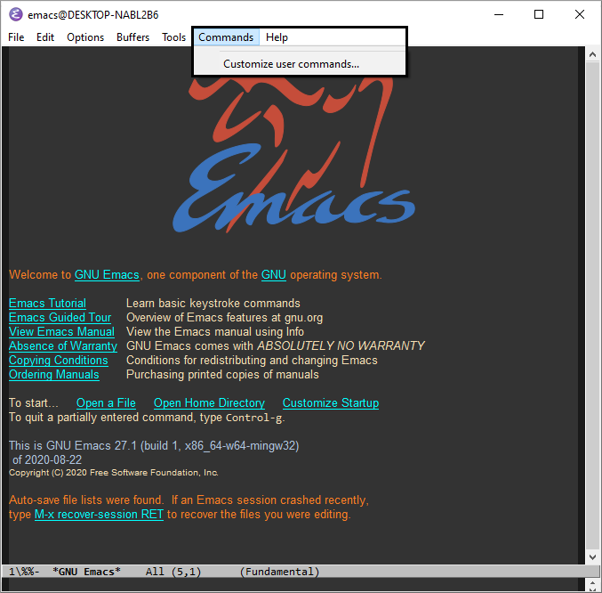
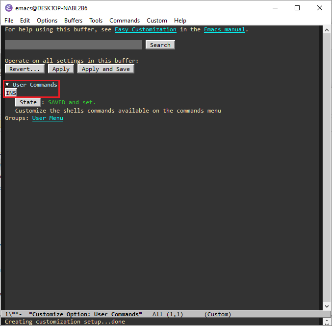
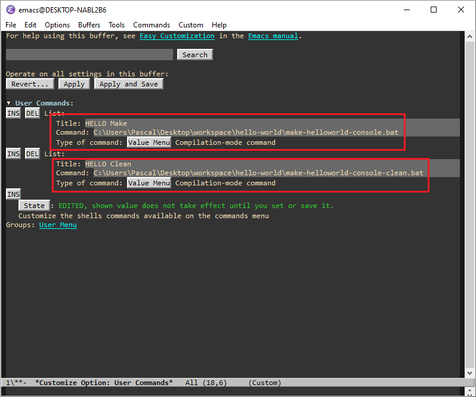
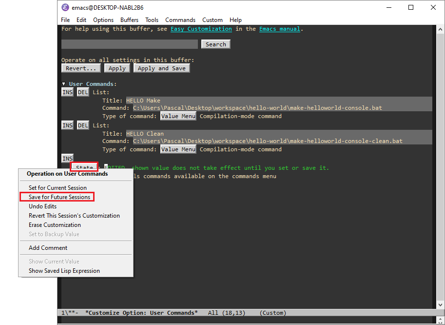
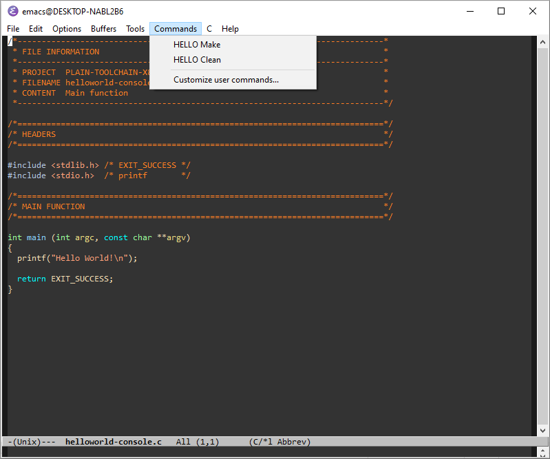
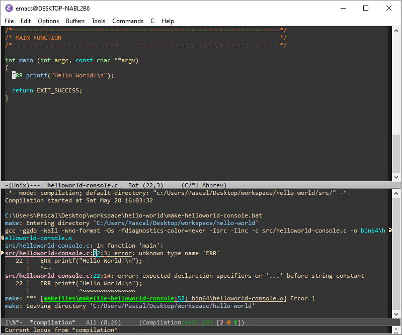
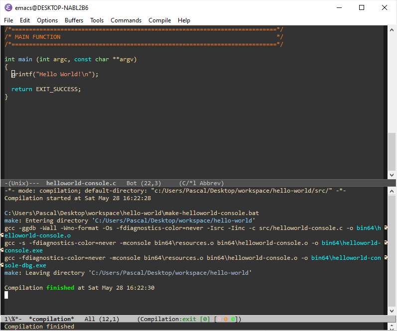

# plain-emacs-commands
This is a convenient way for [GNU Emacs](https://www.gnu.org/software/emacs/) to
switch between different *compilation* targets. This make it very handy to
switch between projects. It basically add a `Commands` menu and a user interface
to add, configure and remove commands. A command can be a shell command or a
compilation target.

A few screenshots would do a better job than a written explanation:





`INS` will `INSERT` a new command. `DEL` will `DELETE` the selected command.











# Emacs Lisp code

I am not very experimented with Emacs Lisp language, so there isn't any proper
major or minor mode. But the code can be easily copy/pasted into `init.el` or
`.emacs`.

These few lines of code have been a great time-saver for me and I don't
understand why something similar is not part of Emacs default configuration.

Notes:
- The user interface is built using the fantastic `customize`
- The menu is built using the `easymenu` library
- The commands are persistent and stored as customize variables

```
(require 'easymenu)

(defvar user-commands-menu nil)

(defun make-menu-item (command-data)
  (let* ((title   (nth 0 command-data))
         (command (nth 1 command-data))
         (type    (nth 2 command-data))
         (func     (cond
                    ((eq type 'COMMAND-TYPE-SHELL)
                     `(lambda ()
                        (interactive)
                        (shell-command ,command)))
                    ((eq type 'COMMAND-TYPE-COMPILE)
                     `(lambda ()
                        (interactive)
                        (compile ,command))))))
    ;; return new menu item
    `[,title ,func]))

;; This function will rebuild a complete new menu if the variable from
;; customize has changed
(defun shell-command-updated (symbol value)
  ;; update the variable value: mandatory
  (set-default symbol value)
  ;; build menu
  (easy-menu-define user-commands-menu nil nil nil)
  (dolist (item value)
    (easy-menu-add-item user-commands-menu nil (make-menu-item item)))
  (easy-menu-add-item user-commands-menu nil ["--" nil])
  (easy-menu-add-item user-commands-menu nil [ "Customize user commands..." (lambda () (interactive) (customize-variable 'user-commands))])
  ;; update menu in the GUI
  (define-key-after (lookup-key global-map [menu-bar])
    [user-commands-menu]
    (cons "Commands" user-commands-menu) 'tools))

(defcustom user-commands nil
  "Customize the shells commands available on the commands menu"
  :group 'user-menu
  :set 'shell-command-updated
  :type '(repeat :tag "Shell command"
                 (list (string :tag "Title")
                       (string :tag "Command")
                       (choice :tag "Type of command"
                               (const :tag "Basic shell command"      COMMAND-TYPE-SHELL)
                               (const :tag "Compilation-mode command" COMMAND-TYPE-COMPILE)))))
```

